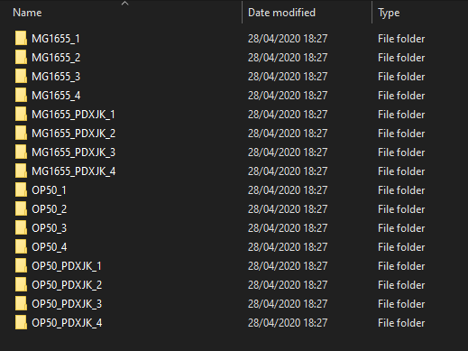

 <!-- arg' should be one of "default", "cerulean", "journal", "flatly", "darkly", "readable", "spacelab", "united", "cosmo", "lumen", "paper", "sandstone", "simplex", "yeti" -->

```{r setup, include=FALSE}
knitr::opts_chunk$set(echo = TRUE, cache = TRUE)
```

## Tutorial to analyse RNA-seq data

This tutorial will cover from the raw data obtained with [**Salmon**](https://combine-lab.github.io/salmon/), to different analyses such as PCA plots, log2FC comparisons, or functional enrichment. The main programming language will be **R**, and although a basic knowledge is required to follow this tutorial, I will try to explain every piece of code.
*
The backbone of this tutorial is the R package [**DESeq2**](https://bioconductor.org/packages/release/bioc/vignettes/DESeq2/inst/doc/DESeq2.html), which is a package that allows you to perform all the statistical comparisons of interest in a very powerful and simple way.
<br>
Let's start by loading the required libraries. 
<br>

```{r message=FALSE}
library(tximport)
library(DESeq2)
```

tximport will allow us to import the files from **Salmon** to R in a easy way. If you followed **Salmon** tutorial, you should have a folder named *Quants* with more subfolders that will be named in a unique name. For example, in our case, we are studying the transcriptome of *C. elegans* with two different *E. coli* strains (OP50 and MG1665), and a double mutation in each one of these strains. Hence, our sample names will be: OP50, MG1655, OP50_PDXJK, and MG1655_PDXJK, with a number determining the replicate. In my case it is like in the following image:

<center>

</center>
<br>
Also, we'll need a file with all the metadata covering our experiment, with sample names that match the folder names that we want to read.

```{r echo=FALSE}
library(knitr)
samples = read.delim("sampleInfo.txt") 
kable(samples, caption = 'My sample file')
```

If you save you metadata into a txt file with tab separation, you can easily read it with 

```{r}
samples = read.delim('sampleInfo.txt')
```


<br><br><br><br>


